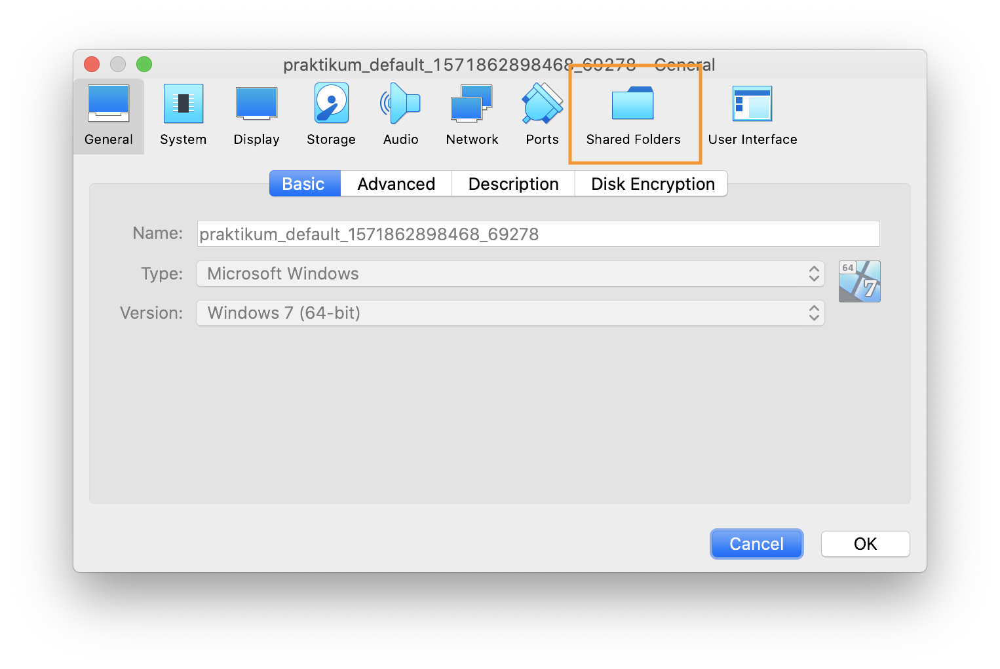

# Installation VM für das MedCT Praktikum

Diese Anleitung zeigt, wie man eine Windows VM für das MedCT-Praktikum
aufsetzt.

Die Anleitung dient dazu Studenten, die kein Windows Betriebssystem haben, am
Praktikum effizient teilnehmen zu lassen.

## Anleltung für macOS

1. Download der folgenden Programme:

   [Vagrant](https://releases.hashicorp.com/vagrant/2.2.6/vagrant_2.2.6_x86_64.dmg)

   [VirtualBox](https://download.virtualbox.org/virtualbox/6.0.14/VirtualBox-6.0.14-133895-OSX.dmg)

1. Installation der Programme.

1. Nach der Installation, ein Terminal öffnen:

   Spotlight Search öffnen (⌘ + Leertaste).

   `Terminal` eingeben.

   Enter drücken das ein Terminal zu öffnen.

1. Mit geöffneten Terminal folgendes eingeben:

   ```
   vagrant init designerror/windows-7 --box-version 1.0 & vagrant up
   ```

   Das stößt den Download an. Dieser wird ca. 8GiB herunterladen.

   Im Anschluss, wird direkt die VM gestartet.

1. Öffnen von VirtualBox:

   Spotlight Search öffnen (⌘ + Leertaste).

   `VirtualBox` eingeben.

   Enter drücken öffnet VirtualBox.

1. Navigieren zu dem Einstellungen von VirtualBox.

   

1. Der die folgende Ansicht sollte erscheinen; hier müssen einige Einstellungen
   vorgenommen werden.

   

1. Den Ordner mit den Praktikumsdateien als shared folder einstellen.

   

   

   Das Ergebnis sollte in etwa so aussehen (natürlich mit anderen Pfaden!)

   

1. Navigieren zu dem Einstellungen von VirtualBox.

   

1. Weitere Einstellungen zu Leistung der VM

   

   

## Installation Ubuntu und Linux Mint

1. Installation der Programme

   [Vagrant](https://releases.hashicorp.com/vagrant/2.2.6/vagrant_2.2.6_x86_64.deb)

   [VirtualBox](https://download.virtualbox.org/virtualbox/6.0.14/virtualbox-6.0_6.0.14-133895~Ubuntu~bionic_amd64.deb)

1. Navigieren zu dem Einstellungen von VirtualBox.

   

1. Der die folgende Ansicht sollte erscheinen; hier müssen einige Einstellungen
   vorgenommen werden.

   

1. Den Ordner mit den Praktikumsdateien als shared folder einstellen.

   

   

   Das Ergebnis sollte in etwa so aussehen (natürlich mit anderen Pfaden!)

   

1. Navigieren zu dem Einstellungen von VirtualBox.

   


1. Weitere Einstellungen zu Leistung der VM

   

   
